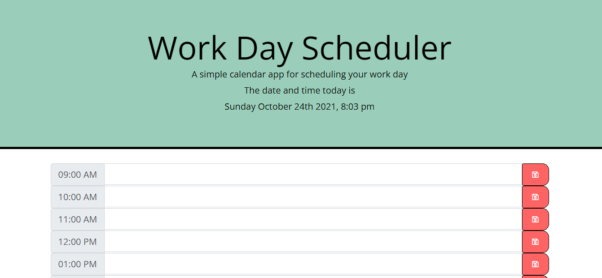

# Scheduling Assistant

## User Story
As a busy employee, I want to be able to manage my time with a schedule to be the most productive that I can be.

## What is the Scheduling Assistant?
A simple calendar webpage that shows the current date and time, and allows the user to save events for each hour of the day. 

## What does it feature?

A save button that stores entries in localstorage.

Current date and time display.

## Image

